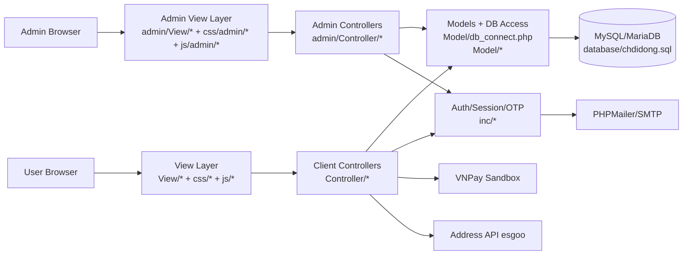
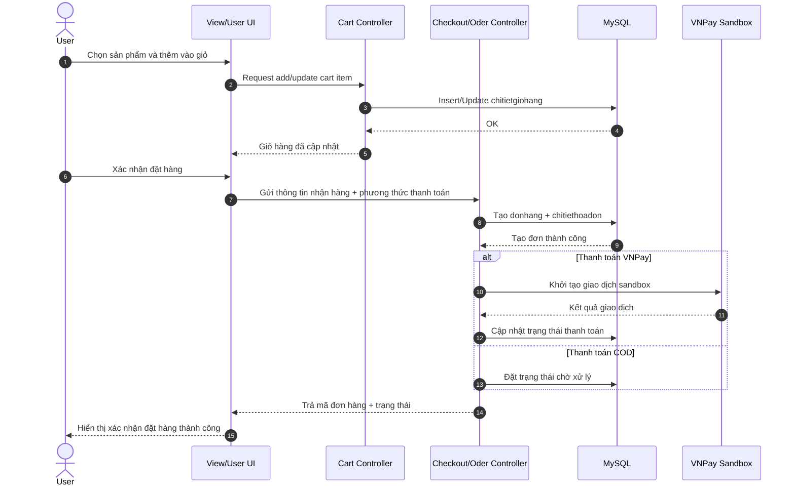
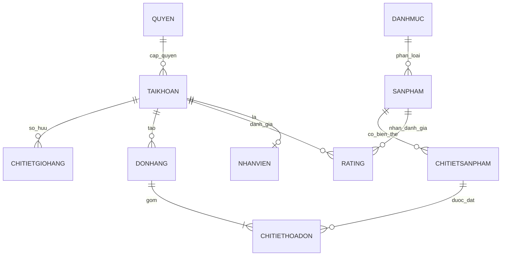

# E-commerce Website - Mobile Store


Website thương mại điện tử chuyên bán điện thoại, xây dựng theo kiến trúc PHP MVC cơ bản. Dự án phù hợp cho học tập, demo nghiệp vụ bán hàng online và có thể mở rộng thành hệ thống thực tế.

## Mục lục

- [1) Giới thiệu dự án](#1-giới-thiệu-dự-án-)
- [2) Công nghệ sử dụng](#2-công-nghệ-sử-dụng-️)
- [3) Tính năng chính](#3-tính-năng-chính-)
- [4) Cấu trúc thư mục](#4-cấu-trúc-thư-mục)
- [5) Hướng dẫn cài đặt](#5-hướng-dẫn-cài-đặt)
- [6) Hình ảnh demo](#6-hình-ảnh-demo)
- [7) API/Endpoint chính](#7-apiendpoint-chính-php-handlers)
- [8) Đóng góp](#8-đóng-góp)
- [9) License](#9-license)
- [10) Thông tin tác giả](#10-thông-tin-tác-giả)
- [11) Sơ đồ kiến trúc hệ thống](#11-sơ-đồ-kiến-trúc-hệ-thống-mermaid)
- [12) Sequence flow đặt hàng](#12-sequence-flow-đặt-hàng)
- [13) ERD rút gọn database](#13-erd-rút-gọn-cho-database)
- [English Summary](#english-summary-optional)

## 1) Giới thiệu dự án 📦

**E-commerce Mobile Store** là nền tảng web bán điện thoại gồm 2 phân hệ:

- **Client/User**: hiển thị sản phẩm, tìm kiếm/lọc, giỏ hàng, đặt hàng, đánh giá.
- **Admin**: quản lý sản phẩm, đơn hàng, tài khoản, nhân sự, thống kê vận hành.

### Mục tiêu dự án

- Ứng dụng kiến thức xây dựng web full-stack với PHP + MySQL.
- Mô phỏng quy trình vận hành của một cửa hàng mobile online.
- Làm nền tảng demo/portfolio và có thể nâng cấp lên production.

### Phạm vi hiện tại

- Dự án tập trung vào tính năng nghiệp vụ bán hàng cốt lõi.
- Dữ liệu và xác thực triển khai theo mô hình session PHP.
- Có tích hợp gửi OTP và luồng thanh toán thử nghiệm.

## 2) Công nghệ sử dụng 🛠️

### 2.1 Core Stack

- **Frontend**: HTML, CSS, JavaScript (jQuery, Fetch API), render qua PHP views.
- **Backend**: PHP thuần theo cấu trúc `Controller - Model - View`.
- **Database**: MySQL (SQL dump: `database/chdidong.sql`).

### 2.2 Thư viện và tích hợp

- **PHPMailer** (qua Composer) để gửi email/OTP.
- **PHP Session** cho xác thực người dùng và admin.
- **VNPay Sandbox** cho luồng thanh toán thử nghiệm.
- **esgoo API** cho danh mục địa chỉ (tỉnh/quận/phường) khi đặt hàng.

### 2.3 Ghi chú về framework

- Dự án **không dùng ReactJS/NextJS** ở phiên bản hiện tại.
- Dự án **không dùng Spring Boot/NodeJS** ở phiên bản hiện tại.
- Có thể mở rộng thành REST API chuẩn hóa ở các phiên bản sau.

### 2.4 Môi trường đề xuất

- PHP 8.x
- Apache/Nginx (khuyến nghị Apache qua XAMPP)
- MySQL 8.x hoặc MariaDB 10.x
- Composer 2.x

## 3) Tính năng chính 🚀

### 3.1 Người dùng (User)

- Đăng ký tài khoản, đăng nhập, quên mật khẩu qua OTP.
- Xem sản phẩm theo danh mục, xem chi tiết biến thể sản phẩm.
- Tìm kiếm/lọc theo nhu cầu mua sắm.
- Quản lý giỏ hàng (thêm, cập nhật số lượng, xóa).
- Đặt hàng và theo dõi trạng thái đơn hàng.
- Đánh giá sản phẩm sau khi đơn đã hoàn tất.
- Quản lý thông tin cá nhân và danh sách sản phẩm yêu thích.

### 3.2 Quản trị (Admin Dashboard)

- Quản lý sản phẩm, danh mục, nhà cung cấp.
- Quản lý đơn hàng, hóa đơn, phiếu nhập.
- Quản lý tài khoản, vai trò/quyền, nhân viên.
- Theo dõi thống kê và vận hành nội bộ.
- Hỗ trợ các nghiệp vụ admin qua module riêng trong thư mục `admin/`.

### 3.3 Luồng nghiệp vụ tiêu biểu

1. User đăng nhập hệ thống.
2. Chọn sản phẩm, thêm vào giỏ, cập nhật số lượng.
3. Nhập thông tin nhận hàng và chọn phương thức thanh toán.
4. Tạo đơn hàng và theo dõi trạng thái đơn.
5. Sau khi giao thành công, user có thể gửi đánh giá sản phẩm.

## 4) Cấu trúc thư mục

```text
.
├── admin/                      # Khu vực quản trị (controller + view + module quản lý)
│   ├── Controller/             # Xử lý nghiệp vụ admin
│   ├── View/                   # Giao diện admin
│   └── logs/, uploads/         # Log và tài nguyên upload
├── Controller/                 # Nghiệp vụ phía client (cart, product, rating...)
├── Model/                      # Kết nối DB, model dữ liệu và truy vấn
├── View/                       # Giao diện người dùng cuối
├── inc/                        # Auth flow: login/signup/otp/session/reset mật khẩu
├── css/                        # CSS cho user + admin
├── js/                         # JavaScript cho user + admin
├── database/                   # SQL schema + dữ liệu mẫu
├── images/                     # Ảnh sản phẩm/hệ thống
├── vendor/                     # Thư viện Composer (PHPMailer...)
├── index.php                   # Entry point user site
└── indexAdmin.php              # Entry point admin site
```

### Các module quan trọng

- `Controller/cart/`: xử lý giỏ hàng, checkout, kiểm tra trạng thái giỏ.
- `Controller/rating/`: xử lý đánh giá sản phẩm.
- `Controller/showproductControler/`: lấy dữ liệu sản phẩm hiển thị.
- `inc/`: xử lý xác thực, OTP, reset mật khẩu.
- `admin/Controller/`: các chức năng quản trị theo từng domain.

## 5) Hướng dẫn cài đặt

## 5.1 Clone repository

```bash
git clone https://github.com/XnCanh/E-commerce-Website---Mobile-Store.git
cd E-commerce-Website---Mobile-Store
```

## 5.2 Cài dependencies

```bash
composer install
```

Nếu chưa có Composer, tham khảo: https://getcomposer.org/

## 5.3 Thiết lập database

1. Tạo database mới:

```sql
CREATE DATABASE chdidong CHARACTER SET utf8mb4 COLLATE utf8mb4_unicode_ci;
```

2. Import dữ liệu từ file `database/chdidong.sql`.
3. Kiểm tra thông tin kết nối tại:

- `Model/db_connect.php`
- `admin/Controller/connectDB.php`

Ví dụ cấu hình local mặc định:

```php
$host = "localhost";
$username = "root";
$password = "";
$dbname = "chdidong";
```

## 5.4 Chạy ứng dụng (backend + frontend)

### Cách 1: Dùng XAMPP (khuyến nghị)

1. Copy project vào thư mục `htdocs`.
2. Khởi động Apache và MySQL.
3. Truy cập:

- User: `http://localhost:3000/View/trangchu/trangchu.php`


### Cách 2: PHP built-in server

```bash
php -S localhost:3000
```

Truy cập: `http://localhost:3000`

## 5.5 Thiết lập email/OTP (nếu dùng)

- Kiểm tra cấu hình SMTP trong các file xử lý OTP/mail thuộc `inc/`.
- Nên tách thông tin nhạy cảm ra `.env` (đề xuất cho phiên bản nâng cao).

## 5.6 Thiết lập thanh toán VNPay sandbox (nếu dùng)

- Kiểm tra cấu hình tại các file trong `View/cart/` liên quan VNPay.
- Dùng thông số sandbox, không dùng key production cho môi trường local.

## 5.7 Troubleshooting nhanh

- **Lỗi kết nối DB**: kiểm tra host/port/user/password/database.
- **Lỗi gửi mail**: kiểm tra SMTP host, port, auth, app password.
- **Lỗi 404 endpoint**: kiểm tra đường dẫn tương đối giữa `View` và `Controller`.
- **Session không lưu**: kiểm tra quyền ghi và cấu hình PHP session.

## 6) Hình ảnh demo

Bạn có thể thay link placeholder bằng ảnh thật trong thư mục `docs/images` hoặc link CDN.


## 7) API/Endpoint chính (PHP handlers)

Hệ thống hiện tại dùng mô hình endpoint theo file PHP. Danh sách tiêu biểu:

| Nhóm | Endpoint | Method | Input chính | Mô tả |
|------|----------|--------|------------|------|
| Auth | `/inc/signup.inc.php` | POST | form-data | Đăng ký tài khoản |
| Auth | `/inc/login.inc.php` | POST | form-data | Đăng nhập người dùng |
| Auth | `/inc/send_otp.php` | POST | form-data/email | Gửi OTP |
| Auth | `/inc/verify_otp.php` | POST | form-data/otp | Xác thực OTP |
| Product | `/Controller/showproductControler/getData.php` | GET | - | Lấy dữ liệu hiển thị danh mục/sản phẩm |
| Cart | `/Controller/cart/getCartQuantity.php` | GET | session user | Lấy số lượng item trong giỏ |
| Cart | `/Controller/cart/check_cart.php?idSP={id}&idCTSP={id}` | GET | query + session | Kiểm tra sản phẩm có trong giỏ |
| Rating | `/Controller/rating/saveReview.php` | POST (JSON) | `idCTSP`, `rating`, `comment` | Gửi/cập nhật đánh giá |
| Admin | `/admin/Controller/getUserInfo.php` | GET | session admin | Lấy thông tin admin đăng nhập |

## 8) Đóng góp

Mọi đóng góp đều được chào đón. Quy trình đề xuất:

1. Fork repository.
2. Tạo nhánh mới:

```bash
git checkout -b feature/ten-tinh-nang
```

3. Commit thay đổi:

```bash
git commit -m "feat: mo ta thay doi"
```

4. Push nhánh:

```bash
git push origin feature/ten-tinh-nang
```

5. Mở Pull Request để review.

### Quy ước commit khuyến nghị

- `feat:` thêm tính năng
- `fix:` sửa lỗi
- `refactor:` cải tiến code không đổi hành vi
- `docs:` cập nhật tài liệu
- `chore:` thay đổi công cụ/cấu hình

### Checklist trước khi tạo PR

- Code chạy được ở local.
- Không làm hỏng luồng đăng nhập/giỏ hàng/đặt hàng.
- Không commit thông tin nhạy cảm.
- Có mô tả rõ phạm vi thay đổi.

## 9) License

Hiện tại repository chưa có file `LICENSE` riêng.

- Mặc định: **All rights reserved**.
- Khuyến nghị: bổ sung `MIT License` hoặc `Apache-2.0` nếu muốn mở rộng đóng góp cộng đồng.

## 10) Thông tin tác giả

- **Tên:** Xuan Canh
- **GitHub:** https://github.com/XnCanh

---

## 11) Sơ đồ kiến trúc hệ thống (Mermaid)



Ghi chú:
- Kiến trúc hiện tại theo mô hình PHP MVC truyền thống, render server-side.
- Tầng View gọi các PHP handlers trong Controller theo luồng nghiệp vụ.
- Tầng Model tập trung kết nối và thao tác dữ liệu MySQL.

## 12) Sequence flow đặt hàng



Luồng sau đặt hàng:
- Admin xử lý đơn trong khu vực admin và cập nhật trạng thái.
- Khi đơn hoàn tất, user có thể gửi đánh giá sản phẩm.

## 13) ERD rút gọn cho database

### 13.1 Danh sách bảng cốt lõi

| Bảng | Vai trò |
|------|---------|
| `taikhoan` | Lưu thông tin tài khoản người dùng/admin |
| `sanpham` | Thông tin sản phẩm |
| `chitietsanpham` | Biến thể sản phẩm (màu, bộ nhớ, tồn kho...) |
| `danhmuc` | Danh mục sản phẩm |
| `chitietgiohang` | Chi tiết giỏ hàng theo tài khoản |
| `donhang` | Đơn hàng |
| `chitiethoadon` | Chi tiết sản phẩm trong từng đơn |
| `rating` | Đánh giá sản phẩm theo người dùng |
| `nhanvien` | Dữ liệu nhân sự phục vụ admin |
| `quyen` / `role` | Quản lý phân quyền |

### 13.2 Quan hệ chính (ERD compact)



### 13.3 Khóa chính và khóa ngoại tiêu biểu

| Bảng | Primary Key | Foreign Key tiêu biểu |
|------|-------------|-----------------------|
| `taikhoan` | `idTK` | `idQUYEN -> quyen.idQUYEN` |
| `sanpham` | `idSP` | `idDM -> danhmuc.idDM` |
| `chitietsanpham` | `idCTSP` | `idSP -> sanpham.idSP` |
| `chitietgiohang` | (composite) `idTK`, `idSP`/`idCTSP` | `idTK -> taikhoan.idTK` |
| `donhang` | `idHD` | `idTK -> taikhoan.idTK` |
| `chitiethoadon` | (composite) `idHD`, `idCTSP`/`idSP` | `idHD -> donhang.idHD` |
| `rating` | `id` | `idSP -> sanpham.idSP`, `idTK -> taikhoan.idTK` |

Lưu ý:
- Tên cột thực tế có thể khác nhau nhẹ giữa các module theo phiên bản SQL dump.
- ERD trên tập trung vào nghiệp vụ bán hàng cốt lõi để dễ onboarding.

## English Summary (Optional)

This is a PHP + MySQL mobile e-commerce web application with both user and admin modules. It supports authentication, product listing/filtering, cart and checkout flows, order tracking, post-purchase rating, and admin operations (products, orders, accounts, and statistics). The project is suitable for learning, demos, and incremental production hardening.
